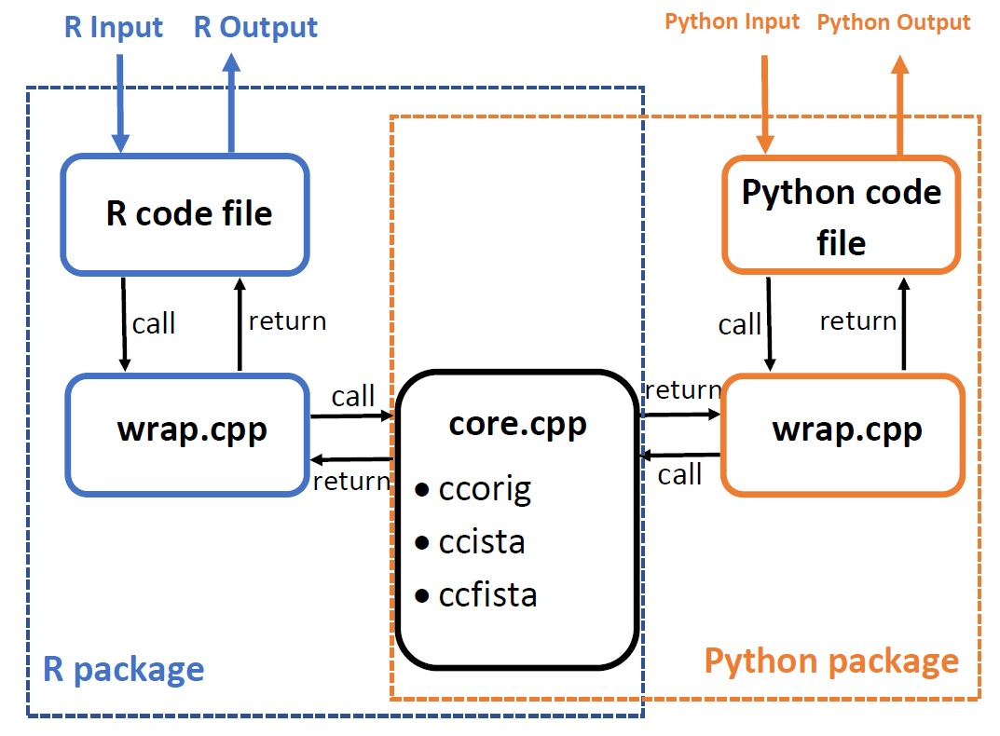
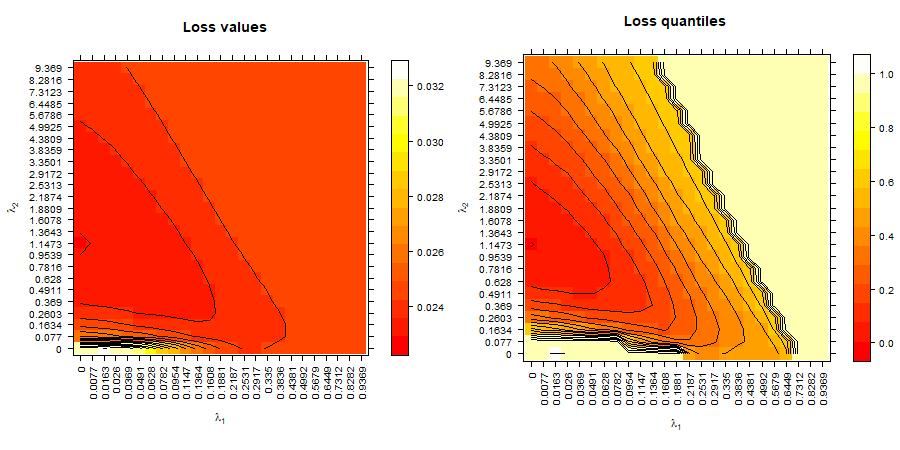

# Summary

Graphs have played an important role in the modern statistical analysis due to their ability to intuitively capture and describe relationships among a group of variables. The sparse precision matrix (or the undirected graphical model) is a popular tool to characterize the underlying dependency relationships of variables. There are several methods for the sparse precision matrix estimation. Graphical lasso is formulated for multivariate Gaussian distributed data when observations were limited [@Friedman2008]. It can be obtained by the R package ``glasso`` or the Python module ``graphical_lasso`` in the scikit-learn library. To extend the application to non-Gaussian data, the SPACE (Sparse PArtial Correlation Estimation) method is proposed [@Peng2009] and can be obtained by the R package ``space``.  However, the convergence is not guaranteed in SPACE method. As an improvement, graphical Concord (CONvex CORrelation selection methoD) is proposed as a sparse penalized maximum pseudo-likelihood estimator for the precision matrix [@Khare2014; @Ali2017]. Multiple approaches have been introduced to solve the Concord optimization problem [@Oh2014; @Ali2017], but no package implements and unifies all the approaches. The purpose of this software is to fill this gap.

We develop both the R and the Python packages that use graphical Concord method to estimate a sparse precision matrix. The algorithms used in our packages include coordinate-wise descent algorithm, ISTA (Iterative Soft-thresholding Algorithm), and FISTA (Fast Iterative Soft-thresholding Algorithm). Both packages share the same core file implemented using C++ languages. The packages are flexible, user-friendly, and easy to maintain. The structure of the packages can be visualized in Figure 1.

<center>



</center>

The R package contains the Concord solver function ``gconcord``, the cross-validation function ``cv.gconcord``, and other supporting functions. The Python package contains the Concord solver class ``GraphicalConcord`` and the cross-validation class ``GraphicalConcordCV``. 


# Statement of need

Our software provides sparse estimations for the precision matrices by solving pseudo-likelihood based objective function with a combination of $l_1$ and Frobenius norm penalties. The objective function does not depend on the Gaussian functional form and the convergence of the algorithm is guaranteed.


# The graphical Concord optimization problem

Suppose that $y_1, y_2, \cdots, y_n$ are i.i.d. (independent and identically distributed) samples taking values in $\mathbb{R}^p (p\geq2)$ from some distribution with unknown true covariance matrix $\mathbf{\Sigma}$. The sample covariance matrix is computed as

$$
\mathbf{S} = \frac{1}{n - 1}\sum_{i=1}^n(y_i - \bar{y})(y_i - \bar{y})^{\top}
\quad\text{where}\quad
\bar{y} = \frac{1}{n}\sum_{i=1}^ny_i
$$

Let $\mathbf{\Omega}_D$ be a diagonal matrix whose diagonal elements are the diagonal elements of the matrix $\mathbf{\Omega}$. Let $\mathbf{\Omega}_{\backslash D} = \mathbf{\Omega} - \mathbf{\Omega}_D$, $\|\mathbf{\Omega}\|_1$ and $\|\mathbf{\Omega}\|_F$ be the $l_1$ norm and the Frobenius norm of the matrix $\mathbf{\Omega}$. The graphical concord estimator is the solution of the optimization problem

$$
\min_{\mathbf{\Omega}\in\mathbb{R}^{p\times p}}
\Big(
-\frac{1}{2}\log\det((\mathbf{\Omega}_D)^2) + \frac{1}{2}\text{tr}(\mathbf{S}\mathbf{\Omega}^2) + \|\mathbf{\Lambda}_1\circ\mathbf{\Omega}_{\backslash D}\|_1 + \lambda_2\|\mathbf{\Omega}\|_F
\Big)
$$

where $\mathbf{\Lambda}_1 = ((\lambda_{ij}))_{1\leq i,j\leq p}$ is a $p\times p$ matrix parameter for the $l_1$ penalty, and $\lambda_2\geq0$ is a scalar parameter for the Frobenius norm penalty. The symbol $\circ$ denotes an element-wise multiplication between two matrices of the same size. If all non-diagonal elements of $\mathbf{\Lambda}_1$ are the same (i.e. $\lambda_{ij} = \lambda_1\geq0$) for all $1\leq i,j\leq p$, then the $l_1$ term is reduced to the term $\|\mathbf{\Lambda}_1\circ\mathbf{\Omega}_{\backslash D}\| = \lambda_1\|\mathbf{\Omega}_{\backslash D}\|_1$.


# An example for R package

Suppose we hope to estimate a sparse precision matrix for the stock returns of Dow Jones Industrial Average (DJIA) component stocks from December 1, 2017 to December 31, 2017. We extract the required data, conduct the cross-validation to find out the optimal $\lambda_1$ and $\lambda_2$ (we take all non-diagonal elements of $\mathbf{\Lambda}_1$ as the same). In the cross-validation procedure, the loss values and the quantiles of loss values over the grid of $(\lambda_1, \lambda_2)$ can be visualized in Figure 2.

```r
library(gconcord)
data = get.data(start = "2017-12-01", end = "2017-12-31", type = "return")
set.seed(1)
cv = cv.gconcord(data, K = 5)
p1 <- cvplot(cv$val.error, main = "Loss values")
p2 <- cvplot(cv$val.error.quantile, main = "Loss quantiles")
grid.arrange(p1, p2, ncol = 2)
```

<center>



</center>


The sparse estimation of the precision matrix is computed as

```r
omega <- gconcord(data = data, lambda1 = cv$lam1.optimal, 
lambda2 = cv$lam2.optimal)
```

# An example for Python package

In this example, we generate multivariate normal random numbers, conduct the cross-validation to find out the optimal penalty parameters and compute the graphical Concord estimator. The code is shown as follows.

```Python
import numpy as np
from gconcord.graphical_concord_ import GraphicalConcord, GraphicalConcordCV

p = 50                        ## data dimension
mean = [0 for i in range(p)]  ## zero-mean
cov = np.diag(np.random.uniform(1, 2, p))  ## diagonal covariance matrix
x = np.random.multivariate_normal(mean, cov, 40)

cv = GraphicalConcordCV()     ## set cross-validation 
cvans = cv.fit(x)             ## fit the data
model = GraphicalConcord(lam1 = cv.lam1, lam2 = cv.lam2) ## set the solver
ans = model.fit(x)            ## fit the data
ans.omega                     ## print out the estimator
```

# Acknowledgements

Not available.

# Reference

